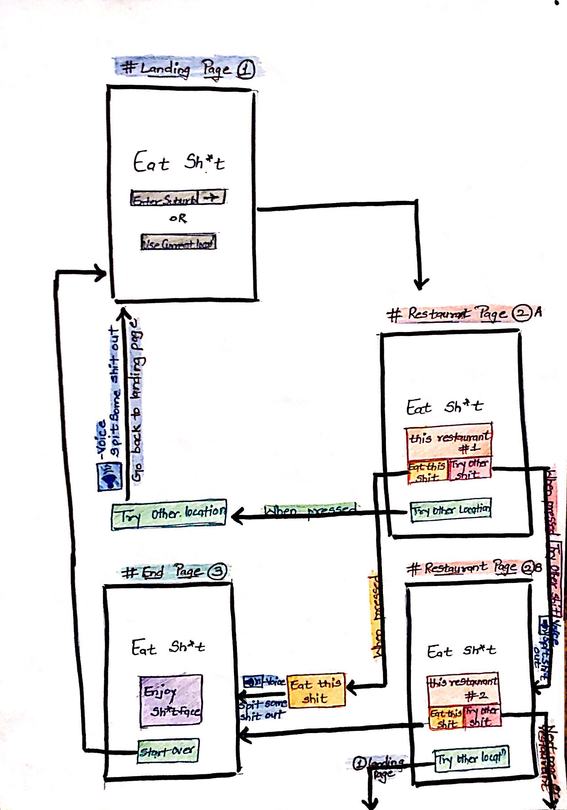

## Eat Sh*t
An app that uses the users location to search for restaurants in the area. It will then spit out one of the worst rated restaurant, and tell the user to eat there, along with a light-hearted insult. 

## APIs to use
We will use Google's text-speech API to read the insult to the user.
We will use Google's Places API for restaurant information.
We will use Google's Maps API to get suburb location or current location

## Team Members
1. Sam
2. Gerard
3. Priyam

## App Sketch

