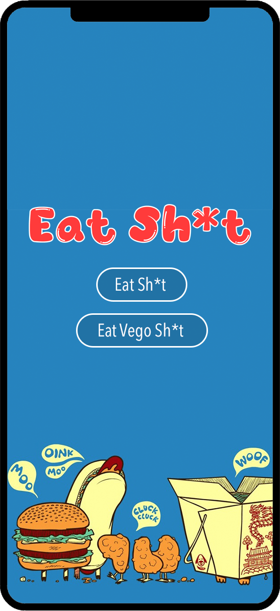

## Eat Sh*t
An app that uses the users location to search for restaurants in the area. It will then spit out one of the worst rated areas, and tell the user to eat there. Along with a light-hearted insult. 

## APIs to use
We will use Googles text-speech API to read the insult to the user.
We will use Zomatos API for restaurant information.
We will use Insult Generator API by Lakerolmaker to randomly query an insult. 

## Team Members
1. Sam
2. Gerard
3. Priyam

## App Sketch
